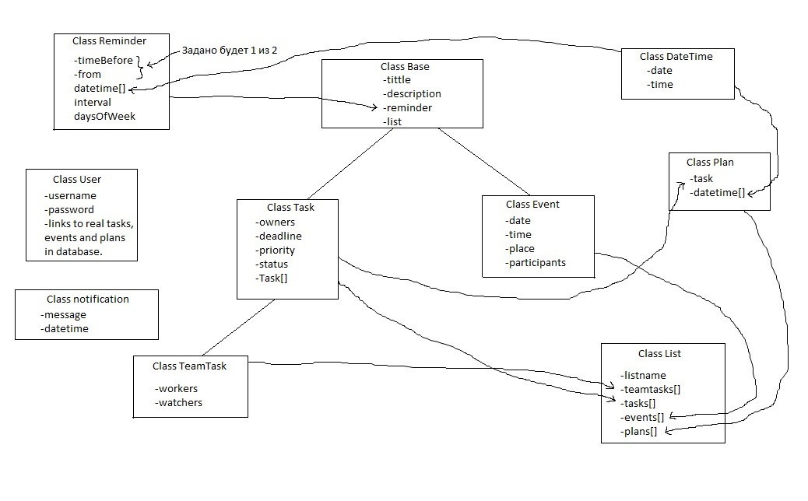
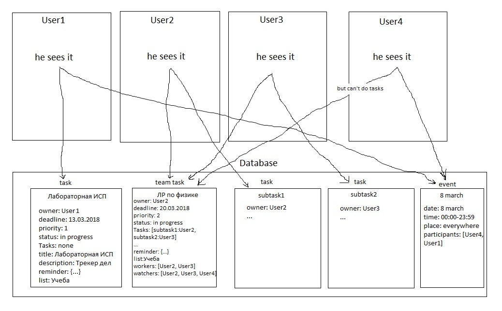

#Отчет о разработке трекера дел nx_todo
## Аналоги
В этом разделе рассмотрим существующие аналоги со стороны обывателя, для того, чтобы понять, какие вещи будут полезны, а каких лучше избежать.

+ ### Списки дел

    В основном предназначены для ведения некоторого списка личных задач с дополнительным пометками: важность, ограничение по времени, примечания, сроки и т.п.  
    Были рассмотрены Wunderlist, Todoist, TickTick. Можно отметить общие достоинства:  

    *Плюсы:*  
    1. На русском языке.  
    2. Красивый и удобный интерфейс.  
    3. Задача добавляется **в несколько кликов**, затем, при желании, ее можно дополнить доп. информацией (подзадачи, напоминания, прикерпленные файлы и др.).
    4. **Разделение задач на списки** (самые популярные предлогаются при первом входе, также пользователь может создавать свои).  
    5. Разделение списков задач **между несколькими пользователями**.  
    6. Возможность **пометить задачу как важную**.  
    7. Есть как веб-версия, так и под десктоп, а также для смартфонов (при этом данные синхронизируются между устройствами).
    
    И в частности:

    + #### Wunderlist
    
        *Плюсы:*
        
        1. Пользователь может настроить фон, при этом цвета остального интерфейса подбираются под цвет фона.
        2. Звуковые сигналы. 
        
        *Минусы:*
        
        1. Существует платная версия. Однако она [не сильно](https://www.wunderlist.com/ru/pro/) ограничивает функционал.
        2. Нельзя задать интервал между напоминаниями (кроме как день, неделя, месяц и тд.).
  
    + #### Todoist

        *Плюсы:*
        
        1. Разделение задач на приоритеты и каждый приоритет выделяется **своим цветом**.
        2. Понравилось то, что пользователь может посмотреть количество **выполненных** задач за определенное время (жаль, что сами задачи только лишь в премиум версии).
        3. Разделение пользователей на уровни. Для повышения уровня, нужно выполнить определенное кол-во задач, что, возможно, подталкивает пользователей к работе.

        *Минусы:*

        1. У приложения есть один большой минус - значительная часть функционала вынесена в премиум версию. Даже такие возможности как комментарии, напоминания и прикрепление файлов недоступны в бесплатной версии.

    + #### Ticktick

        *Плюсы:*

        1. Все хорошие качества Wunderlist и Todoist.

        *Минусы:*

        1. Отсутствие подзадач.

+ ### Календари

    Позволяют установить события, связанные с определенными промежутками времени.

    + ####  Яндекс.Календарь

        *Плюсы:*

        1. Красивый и понятный интерфейс.
        2. **Разделение на календари** (можно создать несколько календарей, и при переключении между ними, события одного календаря не видны в другом).
        3. Возможность выбора, что показывать: день, неделю или месяц.
        4. Одно событие на несколько участников.
        5. Можно сказать, как мы хотим получать уведомления (по почте, смс, CalDav) или вовсе их отключить.
        6. Возможность создать событие, кликнув по тому месту календаря, где нам это нужно.
        7. Возможность создавать дела как в списках дел.
        8. Управление доступом для участников (изменять событие, приглашать других).
        9. Интегрирован с интегрирован с сервисами Яндекс.Почта, Яндекс.Карты, Яндекс.Афиша, Яндекс.Телепрограмма.

        *Минусы:*

        1. По умолчанию, пользователь видит календарь на неделю (это можно изменить в настройках). В этом режиме, мне кажется, выбран не очень удачный масштаб времени (каждый час), приходиться долго листать вниз, при этом поле постоянно "шатается" влево-вправо. 
        2. Для того, чтобы просмотреть все события, нужно, как я понял, просматривать все даты в календаре. То есть нельзя просмотреть такой список как "Все события за ...", а также отсутствует поиск по событию.

    + #### Google Calendar

        *Плюсы:*
        
        Из того, что не было названо в Яндекс.Календарь:

        1. Более гибкая настройка отображения календаря (можно выбрать: 4 дня, год, расписание). Расписание - это как раз тот режим, когда мы **видим все события**.
        2. Когда мы выбираем время события, его можно задать не вводя данные в поля ввода, а просто провести курсором на временной шкале.
        3. Есть приложение для смартфона.

+ ### Трекеры задач

    В общем виде служат для отслеживания выполнения задач в группах людей с иерархической системой управления.

## Сценарии использования

Приложение nx_todo можно будет применять для решения следующих примеров из жизни:

1. Лабораторная работа 13 числа, нужно создать задачу и получать уведомления 2 раза в день, начиная с 10 числа.
2. Для того, чтобы не забыть отправить данные в удаленный репозиторий, 13 числа в 23:00 должно появиться уведомление о событии.
3. Студент учится на военной кафедре, часто бывает так, что он забывает побриться и подшиться в воскресенье вечером. Нужно, чтобы каждое воскресенье утром создавалась соответствующая задача, помеченная как важная.
4. Для того, чтобы не забыть поздравить дам с праздником, весь день 8 марта должно висеть уведомление об этом.
5. Получена лабораторная работа по физике. Группа делится на несколько бригад, на одну бригаду есть задача. Так сложилось, что участники бригады не смогут встретиться для очного выполнения работы. Староста бригады создает задачу, ставит подзадачи и дедлайн для нее и включает остальных в участники. Каждый участник, когда заходит со своей учетной записи, видит новую задачу и выполняет ее.

## Планируемые возможности

Для каждого сценария из предыдущей секции будут описаны возможности приложения, необходимые для покрытия данного сценария.

###Сценарий №0

1. ###Возможность создать учетную запись либо войти в существующий аккаунт.

    + Пользователь вводит имя пользователя и пароль, после чего появляется сообщение о том, что вход выполнен, либо об ошибке.

###Сценарий №1

1. ###Возможность создать задачу.  
    
    + Быстрое добавление.

        Пользователь вводит только текст задачи.

    + Расширенное добавление.
    
        Поьзователь может ввести дату дэдлайна, установить приоритет, установить категорию, статус выполнения, настроить напоминания, создать подзадачи, задать пользователей-владельцев.
        
2. ###Возможность настроить напоминания.  

    + Пользователь указывает определенный момент, после которого будут отображаться напоминания: либо время до дедлайна(в случае события, время до его начала), либо определенная дата и время.  
    + Пользователь задает время для напоминаний: либо массив дат со временем, либо дни недели, либо интервал(т.е. напоминание будет показываться через определенный интервал времени).  

###Сценарий №2

1. ### Возможность создать событие.

    + Быстрое добавление.

        + Пользователь в поле ввода пишет название события.
        + Устанавливается время начала и время окончания.

    + Расширенное добавление.
    
        + Можно добавить описание.
        + Можно добавить круг пользователей, приглашенных на событие.
        + Настраиваются напоминания(см. Сценарий №1).  

###Сценарий №3

1. ###Возможность создать план.  
    
    + Используется механизм создания задачи.
    + Устанавливаются даты. Например, каждое 1 число месяца, каждый понедельник, или просто задаются определенные даты и время.

###Сценарий №4

Используется **"Возможность создать событие"**, время начала и окончания устанавливаются соответсвенно 00:00 и 24:00.

###Сценарий №5

1. ###Возможность создать командную задачу.  
    
    + Используется механизм создания задачи.
    + Указывается, что это задача является командной.
    + После определения задачи, как командной, пользователь указывет "работников"(те пользователи, которые могут выполнять подзадачи) и "наблюдателей"(те, кто только видят задачу и могут следить за ходом выполнения)  

Так же будет ряд таких возможностей как **"Удалить задачу(событие, план)"**, **"Просмотреть всё, или только определенные сущности по заданному фильтру"**, **Просмотреть уведомленя на текущий момент**.

## Логическая архитектура

В данной секции более подробно рассмотрим реализацию планируемых возможностей.

###Стоит описать общую структуру приложения:  

+ Модуль app.py - главный модуль, который координирует работу всех остальных модулей.  
+ Модуль database.py(базовая версия) - отвечает за хранение данных, добавление сущности в базу данных, возвращает список сущностей по определенному критерию.
+ Модуль parser.py(базовая версия) - отвечает за парсинг аргументов командной строки.
+ Модуль remindLoop.py - будет использоваться для обнаружения новых напоминаний.
+ Модуль daemon.py(не мой модуль) - будет использоваться при попытке отслеживания новых напоминаний в фоне. Так же попробую использовать notify2 для отображения уведомлений.
+ Модули task.py, event.py, plan.py, teamtask.py, reminder.py - реализация соответственно для классов задачи, события, плана, командной задачи, reminder.  

###*На следующем рисунке представлены основные сущности приложения.*

Опишем более подробно основные из них:

Класс **Base** - основа для классов Task, Event, TeamTask:

+ title - название(основной текст)
+ description - описание(доп. текст)
+ reminder - объект, который будет отвечать за напоминания владельца.
+ list(category) - категория, к которой относится объект.

Класс **Task** хранит в себе данные о задаче:

+ owners - владельцы задачи.
+ deadline - крайний срок выполнения.
+ priority - приоритет задачи.
+ status - статус выполнения.
+ Task[] - список подзадач.

Класс **Event** хранит в себе данные о событии:

+ from_datetime - время начала события.
+ to_datetime - время окончания события.
+ place - место события.
+ participants - список пользователей-участников события.

Класс **TeamTask** хранит в себе данные о командной задаче:

+ workers - пользователи с правом на выполнение.
+ watchers - пользкователи с правом на просмотр.

Класс **Plan** хранит в себе данные о плане:

+ task - задача, которая будет создаваться.
+ datetime[] - список точных дат, когда нужно будет создать задачу.
+ interval - промежуток между созданиями.
+ daysOfWeek - дни недели, в которые нужно создавать задачу.

Класс **User** хранит в себе данные о пользователе:

+ username - имя пользоователя.
+ password - пароль.
+ tasks, events, plans, teamtasks - массивы данных пользователя.
+ links - ссылки на задачи других пользователей.

Класс **Reminder** хранит в себе данные о напоминаниях:

+ timeBefore или from задают момент времени, с которого можно показывать напоминания.
+ datetime[] - список точных дат, когда нужно будет показать напоминание.
+ interval - промежуток между напоминаниями.
+ daysOfWeek - дни недели, в которые нужно показывать напоминания.
+ parent - ссылка на владельца.

Класс **DataBase** реализует базу данных, содержит логику работы с объектами(добавление, удаление, поиск), хранить в себе массив пользователей.

###Опишем более подробно реализацию возможностей:

####Возможность создать учетную запись либо войти в существующий аккаунт.
*Консольное приложение:*
Пример команды: "./nxtodo login -u username -p password"
После этого в базе данных проверяется наличие пользователя и сверяется пароль.  
*Веб-приложение:*
Ввод будет осуществляться в поля ввода.
     
####Возможность создать(удалить, показать) задачу(событие, план, ком. задачу).
*Консольное приложение:*  
В консольном приложении команда будет выглядеть следующим образом "./nxtodo add(del, show) task(event, ...) task_title -p 1 -o nikita -d 2018/03/30 00:50 -D task_description ...".

1. Модуль app.py создает объект базы данных и загружает данные.
2. Затем app.py парсит аргументы и определяет какая команда была указана(добавить, удалить, показать), вызывает соответсвующий метод у database и передает туда аргументы командной строки.
3. Пример объекта, пришедшего из app.py в объект базы данных:  
    {  
        command: 'add'  
        kind: 'task'  
        title: 'task_title',  
        prioriry: '1',  
        deadline: '2018/03/30 00:50'  
        ...  
        description: 'task_description'  
    }  
4. База данных по аргументам определяет, с какой сущностью будет работать, какое нужно сделать действие и вызывает соответсвтующий метод.  

*Веб-приложение:*  
В веб-приложении принцип будет таким же, за исключением того, что пользователь будет вводить данные в определенные поля ввода.

####Возможность настроить напоминания.
Напоминания будут настраиваться при создании задачи, события и тд.(при этом создается объект класса Reminder). Если пользователь явно не создал напоминания, то объект Reminder создается с полями по умолчанию.  
####Возможность просмотреть напоминания.
Опишем принцип обнаружения напоминаний: модуль app.py обращается к remindLoop.py, тот в свою очередь пробегает по всем задачам(событиям, планам и тд.) пользователя и обращается к объекту reminder у каждой из них. Reminder, исходя из текущего времени либо говорит, что напоминаний нет, либо возвращает объект класса Notification. Поиск напоминаний происходит при запуске приложения, вызове команды "./nxtodo notify", либо через определенные интервалы времени, при работе приложения в фоновом режиме.

###*На этом рисунке схематично показаны некоторые примеры взаимодействия пользователей и базы данных.*

У каждого пользователя будет набор "ссылок" (пока они просто будут как название задачи или события). При входе в приложение, используя эти ссылки, данные загружаются из базы данных и отображаются в пользовательском интерфейсе (в веб-версии). Используется такой принцип для того, чтобы один и тот же объект (задача, событие) могли быть разделены между сколь угодным кол-вом пользоватлей. Так же это удобно тогда, когда мы хотим создать задачу не для себя, а для другого пользователя, тогда мы просто при создании задачи ставим в owner не себя а того, кому адресована задача, а тому пользователю в ссылки добавляем созданную задачу. Тогда при загрузке приложения, наша задача появится в задачах того пользователя.  

Так же это удобно будет при работе с TeamTask: у задачи в поле workers находится пользователь, соответсвенно он видит эту задачу в своих задачах и может начать работу над какой-либо подзадачей. Он выбирает подзадачу и ставит ей в поле owners себя, после этого он может отдельно работать с подзадачей, а подзадача в TeamTask будет отмечена как "разрабатывается пользователем user".

###*На этом рисунке схематично показано то, что будет видеть пользователь в веб-версии.*

## Этапы разработки

+ *Прототип*  

    Будет скрипт, в котором реализованы основные классы, такие как Base, Task, Event, Reminder, Notification. Данные будут храниться в обычном текстовом файле в формате JSON. Приложение будет работать в консольном режиме. Задача прототипа - положить основу и протестировать написанные базовые классы.
    
+ *Базовая версия*

    В базовой версии планируется использование базы данных и реалзация всех классов.

+ *Веб-версия*

    Будет сверстана страничка приложения. Логика из базовой версии связана с пользовательским интерфейсом.

## Сроки
+ до 31 марта - прототип.
+ до 31 апреля - базовая версия.
+ до 31 мая - веб-версиия.
## Статус

Написан отчет о разработке.
